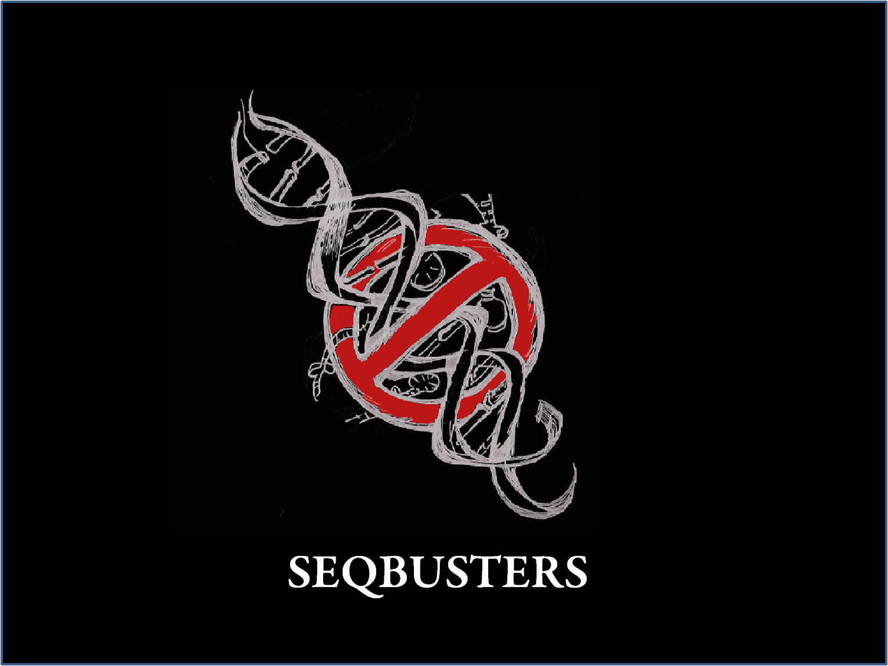

.. seqbuster documentation master file, created by
   sphinx-quickstart on Fri Jul 11 17:06:34 2014.
   You can adapt this file completely to your liking, but it should at least
   contain the root `toctree` directive.

Welcome to seqbuster/seqcluster's documentation!
=====================================

Analysis of small RNA sequencing data. It detect unit of transcription over the genome,
annotate them and create an HTML interactive report that helps to
explore the data quickly.

Contents:

.. toctree::
   :maxdepth: 2

   installation.rst
   
   citation.rst
   
   getting_started.rst
   
   outputs.rst

   example_pipeline.rst 

   mirna_annotation.rst

   collapse.rst

   multi_mapped.rst

   tools.rst

   literature.rst

   presentations.rst

   documentation.rst

   classes.rst
  

Visit `GitHub <http://github.com/lpantano/seqcluster>`_ code

I am in the process to document all classes and methods

Indices and tables
==================

* :ref:`genindex`
* :ref:`modindex`
* :ref:`search`

