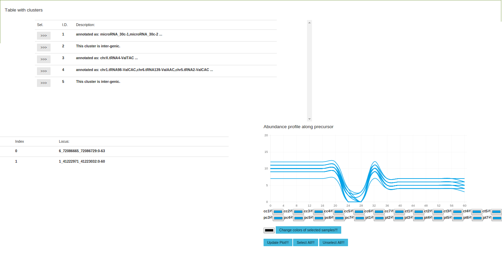

.. _more_output:

***************
More outputs
***************

Report
========

Beside the static HTML report that you can get using ``report`` `subcommand <http://seqcluster.readthedocs.org/getting_started.html#report>`_, you can download `this <https://github.com/lpantano/seqclusterViz/archive/v0.99.zip>`_ HTML. (watch the repository to get notifications of new releases.)

* Go inside ``seqclusterViz`` folder
* Open ``reader.html``
* Upload the ``seqcluster.db`` file generated by ``report`` subcommand.
* Start browsing your data!

An example of the HTML code:

Stats
========

Deprecated (this stats are part of the cluster subcommand now.) 

You can obtain different statistics from the analyais:

* abundance distribution by length of reads that have been aligned, 
that have appear in the output, and annotated with different databases.
To obtain this, you need to run this command::

    samtools index Aligned.sortedByCoord.out.bam
    seqcluster stats -j res/cluster/seqcluster.json -m res/seqs.ma -a Aligned.sortedByCoord.out.bam -o res/stats 
    
The output file is ``stats_align.dat``. It is a 4 column file with the following information:

* size of the read
* sample
* expression
* class: ALIGN (aligned  read), JSON (included in final output), DATABASE (names of the databases assigned to the read)
