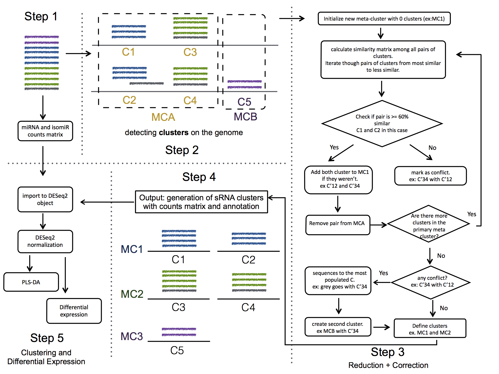

.. _multi_mapped:

***************
Handling multi-mapped reads
***************

**Definition**

multi-mapped reads are the sequences that map more than one time on the genome, for instance, because there are multiple copies of a gene, like happens with tRNA precursors

**Consequence**

Many pipelines ignores these sequences as defaults, what means that you are losing at leas 20-30% of the data. In this case is difficult to decide where these sequences come from and currently there are three strategies:

* ignore them
* count as many times as they appear: for instance, if a sequences map twice, just count it two times in the two loci. This will due an over-representation of the loci abundances, and actually is against the assumption of all packages that perform differential expression in count data.
* weight them: divide the total count by the number of places it maps. In the previous example, each loci would get 1/2 * count. This produces weird dispersion values for packages that fit this value as part of the model.

**Our implementation**

We try to decide the origin of these sequences. The most common scenario is that a group of sequences map two three different regions, probably due to multi-copies on the genome of the precursor. 

We introduce two options:

* most-voting strategy: In this case, we just count once all sequences, and we output this like one unit of transcription with multiple regions. This is the option by default.

* bayes inference: we give the same prior probability to all locations, and use the number of sequences starting in the same position than the one we are trying to predict its location as P(B|A). With this we calculate the posterior that will be used to get the proportion of counts to the different locations. We apply the code from the book: "Think Bayes" ( Allen B. Downey). This is still under development. To activate this option, the user just needs to add `--method babes`

The main advantage of this, it is that it can be the input of any downstream analysis that is applied to RNA-seq, like DESeq, edgeR ... As well, there is less noise, because there is only one output coming from here, not three. 

